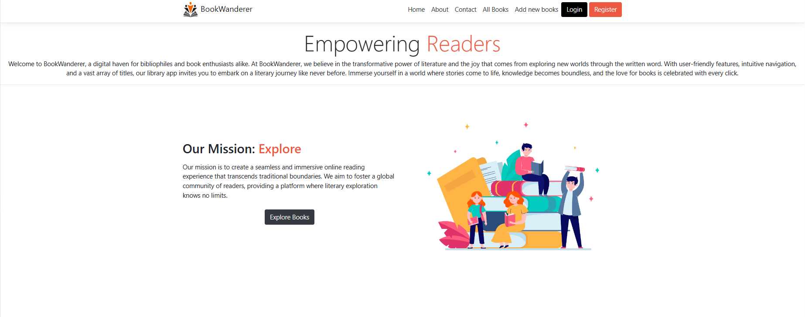

 

  

  
   
  
   <h1 class=" text-center">BookWanderer </h1>
   <h3> Your digital sanctuary for the love of books. Let the adventure begin! </h3>
     
     
    
   
  

<!-- ABOUT THE PROJECT -->

## About The Project

This project is a Web App based on Asp.Net Core MVC architecture for online book library where user can view All books, Detail of Book, PDF of Book. Registered users can Add Books to the Library.

Techstack: Asp.net Core MVC is used for architectural Design. Database is managed by Microsoft Sql Server. Entity Framework Core is used to interact with Database. Identity Core Framework is used to provide security.

### Project Images

Home Page

---

About Us page

---

All Books page

---

Book Detail page

---

Book Reading Page

---

Add Book Page

---

Sign Up Page

---

(<a href="#top">back to top</a>)

### Built With

This section should list any major frameworks/libraries used to bootstrap your project. Leave any add-ons/plugins for the acknowledgements section. Here are a few examples.

- [Asp.net CORE](https://dotnet.microsoft.com/en-us/apps/aspnet)
- [Microsoft Sql Server](https://www.microsoft.com/en-in/sql-server)
- [Entity Framework Core](https://learn.microsoft.com/en-us/ef/)
- [Identity Framework](https://learn.microsoft.com/en-us/aspnet/core/security/authentication/identity?view=aspnetcore-8.0&tabs=visual-studio)
- [Bootstrap](https://getbootstrap.com)

(<a href="#top">back to top</a>)

<!-- LICENSE -->

## License

Distributed under the MIT License. See `LICENSE.txt` for more information.

(<a href="#top">back to top</a>)

